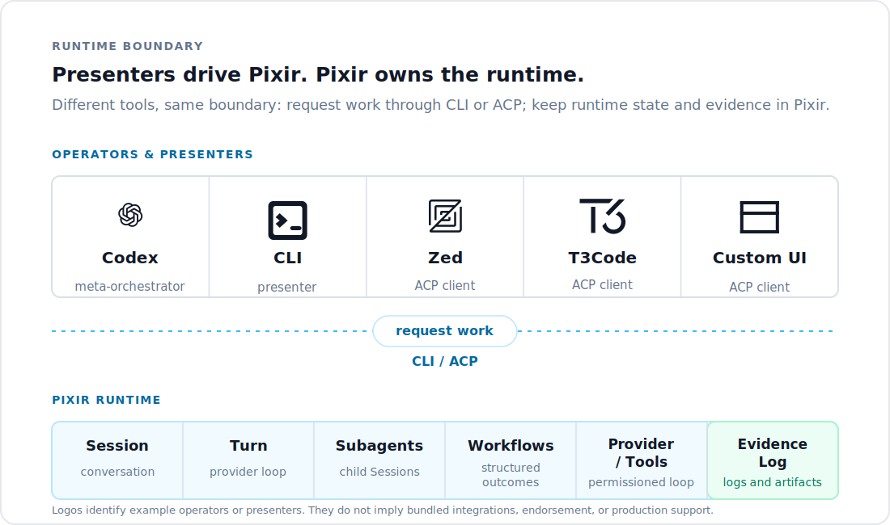

# Pixir

<p align="center">
  
</p>

Pixir is an Elixir/OTP runtime for supervised coding-agent work.

Run it from the CLI or an ACP client. Pixir owns the local Session, Subagent
lifecycle, Workflow outcomes, tool execution, failures, timeouts, and replayable
evidence.

Pixir is a developer preview. The public package is for operators who want the
CLI/ACP runtime; it does not promise a stable Elixir library API.

## Why Pixir

Use any UI. Keep one supervised runtime.

Most coding-agent tools make the chat UI feel like the runtime. Pixir takes the
opposite position: presenters request work; Pixir executes, supervises, and keeps
the evidence.

That matters when agent work becomes long-running or delegated. Subagents need
lifecycle state. Workflows need partial outcomes. Failures and timeouts need to be
inspectable. Pixir records terminal Turn/Subagent evidence and treats partial work as
partial work. Summaries are not evidence; local Logs and artifacts are.

Pixir is for power users and agent operators who want coding-agent work to leave a
durable trail another human or agent can audit.

## Install

From Hex:

```bash
mix escript.install hex pixir
pixir --version
pixir doctor --json
```

From source:

```bash
git clone https://github.com/Ranvier-Technologies/pixir.git
cd pixir

mix deps.get
mix escript.build
./pixir doctor --json
```

Requires Elixir `~> 1.20`. From a source checkout, every `pixir ...` command
below works as `./pixir ...` from the repo root — or put it on your PATH first
with `mix escript.install --force`.

## Authenticate

Use ChatGPT subscription login:

```bash
pixir login
```

Or set an OpenAI API key:

```bash
export OPENAI_API_KEY=...
```

## First Run

Run Pixir inside another repository:

```bash
cd /path/to/your/project
pixir --read-only "inspect this repo and summarize the architecture"
```

Start with `--read-only` when you only need orientation. This keeps the first
turn diagnostic and prevents accidental writes while Pixir proves it can create
local Session evidence.

Ask before writes and unsafe shell commands:

```bash
pixir --ask "make a small safe improvement and run tests"
```

Resume a Session:

```bash
pixir resume <session-id> "continue from there"
```

Inspect local evidence:

```bash
pixir inspect-replay <session-id> --json
pixir diagnose session <session-id> --json
pixir tree <session-id> --json
```

## Runtime Boundary

Different tools, same boundary: operators and presenters request work; Pixir
executes, supervises, and keeps the evidence.

<p align="center">
  
</p>

<p align="center">
  <sub>Logos identify example operators or presenters. They do not imply bundled integrations, endorsement, or production support.</sub>
</p>

Pixir is not another chat surface. It is the supervised local runtime underneath
chat surfaces when work needs lifecycle state, tool execution, replay, partial
outcomes, and auditable Logs.

## ACP

Pixir runs behind ACP clients over stdio:

```bash
pixir acp
```

ACP clients present the work. Pixir remains the runtime: it executes tools, records
Events, maintains Session Logs, and reports lifecycle updates.

## Presenter Confidence

Pixir's developer-preview confidence is based on the runtime boundary, not on a
promise that every client UI projects every detail identically. Local gauntlets have
validated the same source-built runtime through the CLI, T3 Code Pixir dogfood, and
Zed ACP for basic answers, file-reading turns, and bounded Subagent work.

That is enough to use those presenters for dogfood and operator feedback. It is not a
public claim of strict UI parity, production support, or bundled T3/Zed integrations.
When a presenter result matters, reconcile the visible answer with Pixir's local Log,
`inspect-replay`, `diagnose`, and `tree` output.

## What Pixir Includes

- **Runtime:** `Session -> Turn -> Provider -> Tools`, with local Logs as truth.
- **Evidence:** replayable NDJSON Session Logs, Provider usage events, diagnostics,
  replay inspection, and Session/Subagent tree projection.
- **Orchestration:** BEAM-native Subagents, structural Workflows, Workflow Templates,
  checkpoint bundles, durable terminal states, and honest partial outcomes.
- **Operator surfaces:** CLI, ACP stdio, permissions, ChatGPT subscription OAuth,
  API-key fallback, Skills, attachments, and opt-in Provider-hosted Web Search.

## Subagents And Workflows Readiness

Pixir's current Subagent and Workflow contract is operational but deliberately narrow:

- **Supported:** bounded Subagents as supervised child Sessions, structural Workflow
  execution, `wait_agent` partial outcomes, Session/Subagent tree inspection, and
  diagnostics for stale or missing terminal evidence.
- **Verified:** no-network regression gauntlets cover direct CLI fanout and parent-led
  Subagent fanout, including an intentional timeout fixture that must remain honest
  partial evidence instead of clean success.
- **Experimental:** long-running non-blocking client UX, live child-status presentation
  in specific ACP clients, and Workflow Templates as a polished user-facing product
  surface.
- **Not promised:** production scheduling guarantees, cross-client UI parity, or public
  performance claims from local resource-pressure samples.

For a copyable agent-facing `pixir delegate` example, including Codex/Claude Code CLI
calling patterns, see `docs/examples/delegate-cli-live/`. Delegate subagent results
carry `children[].index` (the zero-based `tasks[]` position); the `children` array
order is unspecified, so join results to tasks by index, not position.

## Preview Scope

- Not a stable public Elixir library API.
- Not a standalone Pi-style terminal TUI.
- Not an MCP server.
- Not a packaged T3Code provider.
- Not a production/SLA-backed hosted agent service.

T3Code integration exists as local dogfood through a separate adapter/patch workflow.
It is useful for validating ACP behavior, but it is not the primary public install path
yet.

## Development

For source checkouts:

```bash
mix check
```

`mix check` runs formatting, warnings-as-errors compilation, tests, escript build,
`./pixir doctor --json`, a no-network Workflow smoke, and docs generation.

Networked smoke tasks are manual and opt-in.

## Documentation

- Quickstart: `docs/open-beta-quickstart.md`
- Release notes: `docs/release-notes/open-beta-developer-preview.md`
- Changelog: `CHANGELOG.md`
- Security policy: `SECURITY.md`
- Contributing: `CONTRIBUTING.md`
- Architecture vocabulary: `CONTEXT.md`
- Public contract ADRs:
  - `docs/adr/0016-open-beta-scope.md`
  - `docs/adr/0017-minimal-harness-core-and-interactive-boundary.md`
  - `docs/adr/0018-durable-history-compaction-and-replay-repair.md`
  - `docs/adr/0019-provider-usage-and-prompt-cache.md`
  - `docs/adr/0021-session-resources-and-image-attachments.md`
  - `docs/adr/0022-provider-hosted-web-search.md`
  - `docs/adr/0025-hex-package-scope.md`

Generate local docs:

```bash
mix docs
```

## License

MIT. See `LICENSE`.
