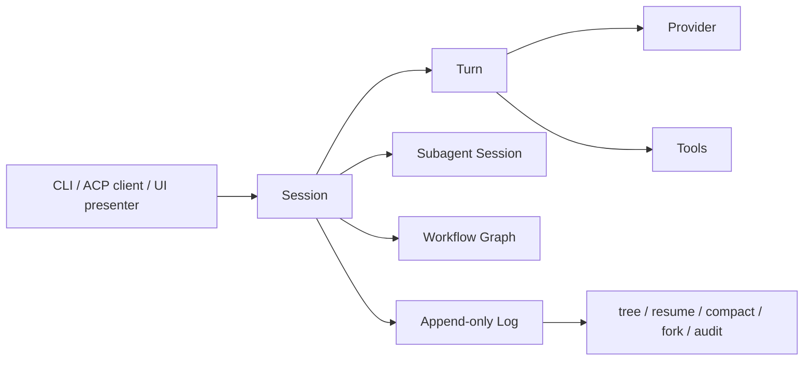

# Pixir Marketing Site Design Direction

Status: Investigation / proposal
Date: 2026-06-19

Verified against:

- `README.md`
- `docs/open-beta-quickstart.md`
- `docs/adr/0016-open-beta-scope.md`
- `docs/adr/0025-hex-package-scope.md`
- `assets/brand/README.md`
- `https://pi.dev/` visual/content review on 2026-06-19
- Vercel Geist light theme token example provided by the operator on 2026-06-19

## Product Position

Pixir's site should not compete as "another AI coding chat UI" or as a Pi-style
terminal replacement. The sharp claim is:

> Supervised subagents and workflows for coding agents.

Pixir is an operator-grade, local-first supervised runtime layer. The public promise is
the CLI and ACP surface: install the escript, run `doctor`, start or resume work,
spawn Subagents, coordinate Workflows, and inspect replayable evidence when the run
matters.

The architectural spine should be visible but not over-explained:

```text
minimal harness + OTP supervision + explicit practices
```

Pi proved that a harness can be small, modifiable, and packageable. Pixir takes that
line seriously, then adds BEAM/OTP runtime semantics for the moment agent work involves
many Sessions, Subagents, Workflows, lifecycle states, timeouts, failed or detached
workers, retries, cancellation, and observability. PATCHMD belongs in this story as an
explicit customization and maintenance practice, not as hidden runtime magic.

Do not position Pixir as:

- a polished Pi TUI replacement;
- a terminal agent whose terminal UI is the product;
- a logging/audit product whose primary value is "we keep logs";
- a packaged T3Code provider;
- a stable public Elixir library API;
- a hosted SaaS agent service;
- a multi-provider marketplace.

## Reference Takeaways

Pi's site is effective because it is opinionated:

- one manifesto headline;
- install command above the fold;
- terminal-first visual proof;
- a clear "what we did not build" section;
- extensibility as the core promise.

Pixir should borrow the confidence and the install immediacy, but not Pi's thesis.
Pi says "change the harness, not your workflow." Pixir should say "run coding agents
as supervised local Sessions under whatever presenter you prefer."

The Vercel Geist example is useful as a quality bar for tokens, density, and restraint:
precise neutral colors, explicit type scale, and UI that feels engineered rather than
decorated. Pixir should not copy Vercel's brand, but it should adopt that level of
systematic polish.

## Site Principles

1. Supervised runtime first.
   The above-the-fold claim should make clear that Pixir runs Sessions, Subagents, and
   Workflows as supervised runtime primitives, not as prompt theater.

2. Presenter boundary is a feature.
   The site should make it obvious that Pixir is the runtime, while CLI, ACP clients,
   Zed, T3Code dogfood, Codex, and future UIs are different categories. Codex is an
   operator/meta-orchestrator and auditor; Zed and T3Code are UI/client/presenters;
   Pixir is the harness/runtime.

3. Evidence earns trust.
   Log as truth, provider usage, replay, resume, tree, fork, compact, and artifacts
   belong as the evidence layer that makes supervised work auditable.

4. Honest beta language builds trust.
   Put "What Pixir is not yet" in the main page, not in a buried FAQ.

5. Operator ergonomics over broad appeal.
   Write for senior engineers, AI-tool builders, SRE-minded operators, and people who
   already understand why replay, diagnostics, and durable logs matter.

6. Technical beauty, not spectacle.
   Use brand geometry, terminal transcripts, event timelines, and architecture diagrams.
   Avoid generic AI gradients, bokeh/orb backgrounds, and stock illustrations.

## Information Architecture

Primary nav:

- Home
- Docs
- ADRs
- Hex
- GitHub

Home sections:

1. Hero
2. Pixir fits under your agent
3. Runtime primitives
4. Operational lifecycle
5. Evidence layer
6. Operator Primitives
7. Preview scope
8. Get Started

Secondary docs pages:

- Quickstart
- Daily Driver Ritual
- CLI Reference
- ACP Contract
- Log / Session Inspection
- Subagents and Workflows
- Architecture Decisions

## Hero

Required first-viewport signals:

- Pixir logo from `assets/brand/pixir-logo.svg`.
- Literal product name in the H1.
- Install command visible without scrolling.
- One visual artifact that looks like Pixir running, not generic AI art.

Recommended copy:

```text
Pixir
Supervised subagents and workflows for coding agents.

Pixir is an Elixir/OTP harness for running agent work as supervised local sessions.
Drive it from the CLI or ACP clients; Pixir owns subagent lifecycle, workflow outcomes,
failures, timeouts, and replayable evidence without making the presenter the runtime.
```

Primary CTA:

```bash
mix escript.install hex pixir
pixir doctor --json
```

Secondary CTAs:

- Read the quickstart
- View Hex package
- Browse ADRs

Hero visual direction:

- Full-width, unframed composition.
- The hero logo belongs in the same layout flow as the H1, preferably a title row
  grid (`h1 + mark`) with an explicit column gap. Do not position the hero logo with
  absolute `top`/`right`; it can look mathematically placed while feeling detached
  from the headline.
- A real terminal transcript or generated terminal-like scene integrated into the
  background, not a floating marketing card.
- The hero should hint at the next section on desktop and mobile.
- Avoid a split "copy left, screenshot card right" layout.

Example terminal transcript:

```text
$ pixir doctor --json
{"ok":true,"status":"ready","version":"0.1.5"}

$ pixir tree <session-id> --json
{"session":"...","children":[...],"log":"append-only"}
```

## Visual System

The site should be light-first with dark technical surfaces. This keeps Pixir distinct
from Pi's dark-retro identity while preserving a terminal-native feel.

### Color Tokens

Use these as starting tokens:

| Token | Hex | Use |
| --- | --- | --- |
| `ink` | `#111827` | Primary text and Pixir structure |
| `muted` | `#4b5563` | Secondary text |
| `subtle` | `#6b7280` | Captions and metadata |
| `canvas` | `#ffffff` | Page background |
| `surface` | `#f8fafc` | Section background |
| `line` | `#e5e7eb` | Borders and dividers |
| `terminal` | `#0b1220` | Terminal/code surfaces |
| `terminal-line` | `#1f2937` | Terminal borders |
| `terminal-muted` | `#94a3b8` | Secondary text on dark terminal surfaces |
| `beam-cyan` | `#14b8ff` | Primary accent from brand |
| `beam-emerald` | `#10b981` | Positive/live/pass evidence |
| `warning` | `#f59e0b` | True warnings and caveats |
| `danger` | `#ef4444` | Explicit unsupported claims |

Do not let the page become a one-note dark slate theme. Use dark surfaces as focused
proof artifacts, not the whole visual language.

Color semantics matter. `beam-cyan` can mark system boundaries, runtime structure, and
neutral product accents. Reserve `beam-emerald` for positive states such as `doctor`
OK, readiness pass, observed cache evidence, or successful diagnostics. Do not alternate
cyan and emerald across equivalent items because that suggests false status differences.
Use `warning` or `danger` only when the UI is naming an actual warning, risk, or failure.

Accessibility constraint: text on `terminal` backgrounds must meet at least WCAG AA
contrast for its rendered size. In the V0 Lighthouse pass, `#64748b` on `#0b1220`
scored 3.93:1 for small terminal/footer text, below the 4.5:1 threshold. Use
`terminal-muted` (`#94a3b8`) or brighter for secondary text on dark technical
surfaces; reserve `subtle` (`#6b7280`) for light backgrounds.

### Typography

Recommended stack:

```css
font-family: "Geist", "Inter", ui-sans-serif, system-ui, sans-serif;
font-family-mono: "Geist Mono", "SFMono-Regular", ui-monospace, monospace;
```

Use a compact, engineering-oriented scale:

| Token | Size | Weight | Line Height | Use |
| --- | ---: | ---: | ---: | --- |
| `display` | `56px` | `650` | `1.04` | Desktop hero only |
| `h1-mobile` | `40px` | `650` | `1.08` | Mobile hero |
| `h2` | `32px` | `620` | `1.16` | Section headings |
| `h3` | `20px` | `620` | `1.30` | Feature headings |
| `body` | `16px` | `400` | `1.65` | Main copy |
| `small` | `14px` | `400` | `1.45` | Captions and metadata |
| `code` | `14px` | `400` | `1.55` | Terminal/code blocks |

Letter spacing should stay `0`. Do not scale type directly with viewport width.

### Layout

- Max readable content width: `1120px`.
- Main horizontal containers should share the same centered width rule, currently
  `width: min(1120px, calc(100% - 32px)); margin: 0 auto;`, so the nav, hero, proof
  panels, and sections feel aligned on desktop.
- On mobile, the header should feel like a small landing-page header, not a left-aligned
  admin rail. Center the brand row and let nav links wrap/center before introducing
  horizontal scrolling or a menu.
- Keep the navbar static by default, including mobile. Do not add sticky install pills
  or bottom mobile CTAs for `Install`; Pixir installation is a shell/developer action,
  not a meaningful mobile action.
- Text measure: `640px` for prose-heavy sections.
- Section padding: `96px` desktop, `56px` mobile.
- Grid gap: `24px` desktop, `16px` mobile.
- Cards, when needed, use radius `8px` or less.
- Do not nest cards inside cards.
- Prefer full-width bands and unframed layouts over decorative containers.

### Accessibility

- Interactive elements must have a visible `:focus-visible` outline with enough
  contrast against both light and dark sections.
- Decorative logos and icons use empty `alt=""`; meaningful visual groups use
  `role="group"` plus an `aria-label`, or `role="list"`/`role="listitem"` when the
  visual is a set of peers.
- Do not rely on `aria-label` on a plain `div` without a semantic role.
- External links with compact labels such as `Hex` and `GitHub` should include
  specific accessible names, for example `Pixir package on Hex`.

### Components

Install block:

- Tabs only if there are real install variants.
- For v0, default to a single Hex command plus source-install disclosure below.
- Copy button with an icon and accessible label.

Terminal panel:

- Dark background.
- Visible prompt, command, and bounded JSON output.
- No fake spinners or unreadable floods.

Beta label:

- Short label: `Developer Preview`.
- Pair with the concrete contract: CLI/ACP stable surface, no stable Elixir API.

Preview scope cards:

- Treat preview limitations as contract boundaries, not warning cards.
- Do not use yellow, orange, or red surfaces unless calling out a true risk or failure.
- Do not use emerald for `Not a...` items; green implies positive/pass semantics.
- Use uniform white or pale slate cards with slate borders, ink headings, muted body
  text, and a shared cyan accent.
- A spec-sheet treatment is preferred when the section needs more Pixir character:
  small monospace labels such as `scope.terminal`, `scope.adapter`, `scope.api`, and
  `scope.sla` are acceptable if every label shares the same neutral/cyan semantics.

Architecture diagram:

Use a simple horizontal flow:



The diagram should use Pixir vocabulary from `CONTEXT.md` and ADRs.

Presenter/runtime boundary diagram:

- Use one section-level matrix, not a set of independent feature cards.
- Keep Codex, CLI, Zed, T3Code, and Custom UI visually in the same
  "operators and presenters" band, but use role labels to avoid category confusion:
  Codex is a `meta-orchestrator`; CLI is a `presenter`; Zed, T3Code, and Custom UI
  are `ACP client` examples.
- It is acceptable to use the OpenAI symbol for the Codex lane and the T3 Stack logo
  for the T3Code lane, but the visible text should remain `Codex` and `T3Code`.
- Pixir itself should not appear as another presenter lane. Show the Pixir logo only
  as ownership branding on the lower `Pixir Runtime` band.
- Use real brand/logo assets only when there is a clear source and provenance note.
  Use generic library icons for non-brand concepts such as CLI, Custom UI, Session,
  Turn, Workflow, Provider/Tools, and Evidence Log.
- The request boundary should be a neutral cyan system line labeled `request work`
  and `ACP / CLI`; do not use green because the boundary is not a pass/success state.
- On mobile, collapse each band into a vertical technical list with icons at the left
  and labels at the right. Do not horizontal-scroll the matrix.

Evidence layer:

- Keep evidence visually separate from the presenter/runtime boundary. The architecture
  matrix explains who requests work and who owns runtime state; Evidence Layer explains
  why that runtime can be audited.
- Prefer a dark proof section with a bounded NDJSON-style log excerpt and three compact
  evidence cards. This makes Log-as-truth feel operational rather than decorative.
- Use `provider_usage` language carefully: cache-aware work is measurable only when
  Provider usage reports cached tokens. Do not imply every run receives cache hits.

## Content Strategy

Primary message:

```text
Pixir is the supervised runtime layer for agentic coding work.
```

Support messages:

- Presenters drive Pixir; Pixir owns the runtime.
- Pixir does not replace Codex. Codex can remain the meta-orchestrator and auditor.
- Subagents are child Sessions with lifecycle, status, logs, and supervision.
- Workflows are runtime graphs: dependencies, concurrency, cancellation, and step
  outcomes are tracked structurally.
- Local Sessions persist as append-only evidence.
- Cache-aware transport and prompt shape are operator-relevant, especially for Subagent
  bursts: WebSocket continuation, stable prompt prefixes, and minimal per-Turn payloads
  should improve cache locality when the Provider supports it.
- Cache hits are never claimed from vibes or latency; Provider usage is recorded for
  token/cache/transport observability, and cached tokens are the evidence.
- OTP supervision gives Pixir a serious runtime story for Sessions, Turns, Subagents,
  timeouts, and cancellation.
- CLI and ACP are presenters; the runtime remains UI-agnostic.
- Subagents and Workflows are supervised, inspectable runtime primitives.
- Skills, Workflow Templates, and PATCHMD are explicit practices, not invisible magic.
- Beta limitations are explicit.

Avoid:

- "Best AI coding assistant"
- "Replace Pi"
- "Multi-provider"
- "Production-ready"
- "No-code agent platform"
- "Self-improving magic"

## Home Page Copy Skeleton

### Hero

```text
Pixir
Supervised subagents and workflows for coding agents.

Pixir is an Elixir/OTP harness for running agent work as supervised local sessions.
Drive it from the CLI or ACP clients; Pixir owns subagent lifecycle, workflow outcomes,
failures, timeouts, and replayable evidence without making the presenter the runtime.
```

### Why Pixir

```text
Use any UI. Keep one supervised runtime.

Pixir sits below the operator and the interface. Codex can plan and audit; Zed,
T3Code, or another ACP client can present the work; Pixir runs the supervised local
Sessions when tasks need subagents, workflows, lifecycle state, replay, and auditable
evidence.
```

### Runtime Model

```text
Session -> Turn -> Provider -> Tools

The model can reason and call tools, but supervised work needs runtime state. A
Subagent can complete, fail, time out, detach, or resume. A Workflow with failed or
timed-out workers must not read as success.
```

### Evidence Layer

```text
Agent work should leave evidence you control.

Log as truth matters because supervised work needs a durable record. Every run can be
inspected, replayed, resumed, forked, compacted, or audited from local artifacts
instead of a hidden chat store.
```

### Operator Primitives

- `doctor`: first-run and regression diagnostics.
- `resume`: continue a real Session.
- `tree`: inspect Session/Subagent hierarchy.
- `compact`: append durable history checkpoints.
- `fork`: branch exploration from a Session.
- `acp`: drive Pixir from UI clients over stdio.

### What Pixir Is Not Yet

```text
Pixir is a developer preview. It is not a polished TUI replacement, not a packaged
T3Code provider, not a stable Elixir library API, and not production/SLA software.
```

## Visual Assets

Use:

- `assets/brand/pixir-logo.svg` for header and hero.
- `assets/brand/pixir-icon.svg` for favicon/provider chip contexts.
- Real terminal transcripts captured from `pixir doctor --json`, `pixir tree`, and
  `pixir compact --dry-run --json`.
- A short animated or static Session timeline if the site needs motion.

Avoid:

- generic robot imagery;
- dark blurred code backgrounds;
- AI gradient orbs;
- screenshots that imply a polished TUI Pixir does not ship.

## Launch Scope

V0 should be a single static site or docs page with:

- hero and install command;
- three proof sections;
- honest beta section;
- links to Hex, GitHub, README, quickstart, and ADRs.

Do not build package browsing, account flows, telemetry, comparison tables, or a T3Code
download page in V0.

## Open Questions

- Should the first public site live under `pixir.dev`, GitHub Pages, or a docs host?
- Should the site offer a T3 Code Pixir DMG as an experimental dogfood artifact, or keep
  it out of the public path until the adapter story is formal?
- Should Pixir publish a short demo video showing `doctor`, first Turn, `tree`, and
  `compact`, or keep V0 purely text/terminal?
